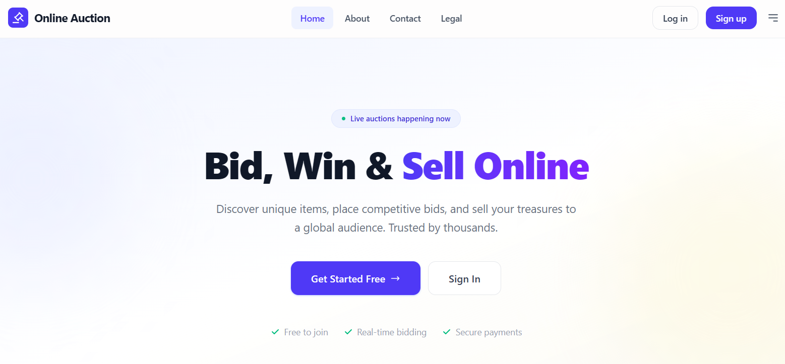
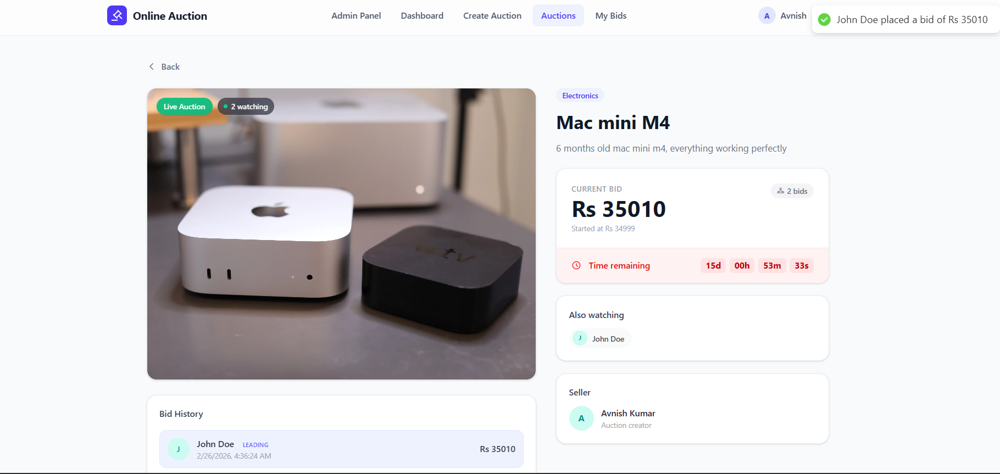
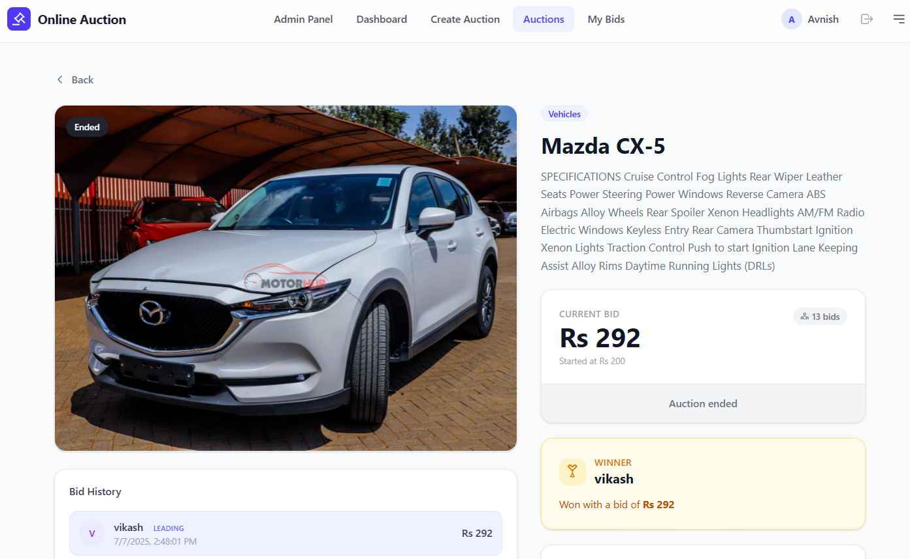
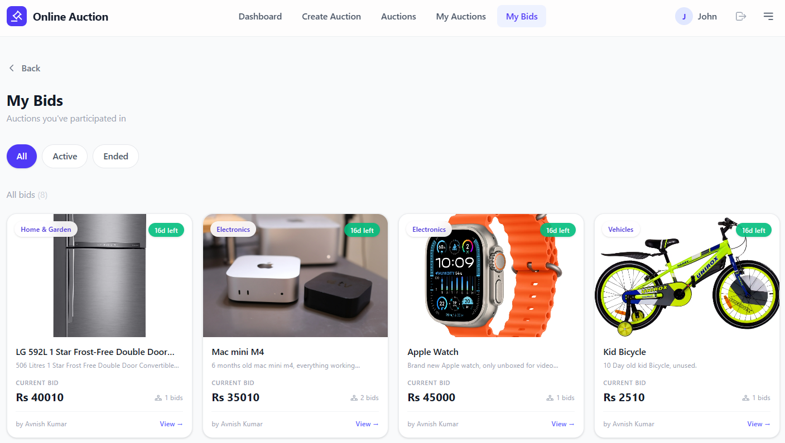
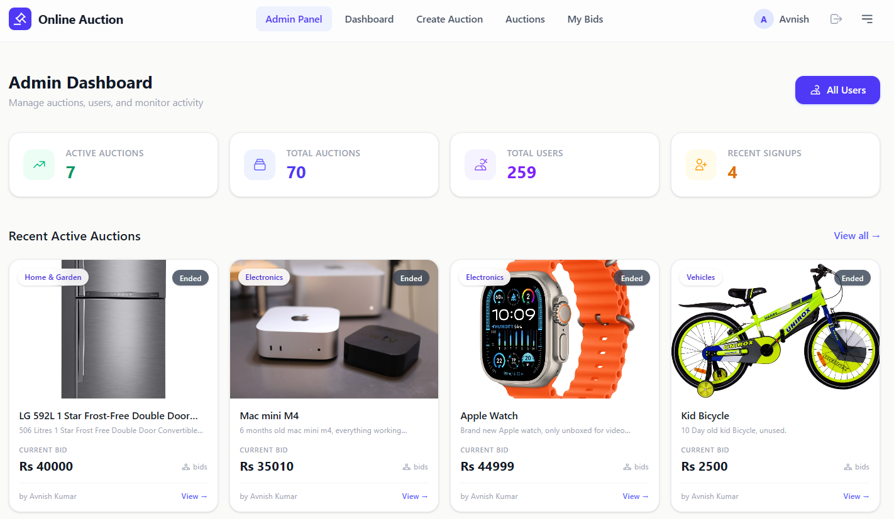

# Auction Platform

A full-stack real-time auction web application built with the MERN stack as a personal learning project.

> **GitHub:** [github.com/Dazzling-Darshan](https://github.com/Dazzling-Darshan)  
> **Repo:** [github.com/Dazzling-Darshan/auction-platform](https://github.com/Dazzling-Darshan/auction-platform)

---

## Screenshots

<table>
<tr>
<td width="33%" align="center">
<b>Landing Page</b><br><br>
<a href="screenshots/landingpage.png"></a>
</td>
<td width="33%" align="center">
<b>User Dashboard</b><br><br>
<a href="screenshots/dashboard.png"></a>
</td>
<td width="33%" align="center">
<b>Auction Page</b><br><br>
<a href="screenshots/auctionpage.png"></a>
</td>
</tr>
<tr>
<td width="33%" align="center">
<b>Auction Winner</b><br><br>
<a href="screenshots/auctionwinner.png"></a>
</td>
<td width="33%" align="center">
<b>My Bids</b><br><br>
<a href="screenshots/mybids.png"></a>
</td>
<td width="33%" align="center">
<b>Admin Dashboard</b><br><br>
<a href="screenshots/admindashboard.png"></a>
</td>
</tr>
</table>

---

## About

This is a personal learning project built to understand full-stack MERN development with real-time features. It covers:

- Real-time bidding using Socket.io
- JWT authentication with httpOnly cookies
- Role-based access control (User / Admin)
- Cloudinary image uploads
- MongoDB with Mongoose
- React with Redux Toolkit and TanStack React Query

---

## Features

| Category | Features |
| --- | --- |
| **Authentication** | JWT with httpOnly cookies · Auto-login on refresh · Role-based access · Password change |
| **Auctions** | Cloudinary image upload · Create auctions · Browse with pagination · Category filtering · Live countdown timers · Auto-winner detection |
| **Real-time Bidding** | Socket.io room-based · Atomic bid updates · Live active user count · Instant bid broadcast |
| **Dashboard** | Personal stats · Recent auctions grid · Quick navigation |
| **Admin Panel** | System-wide statistics · User management with search, sort, pagination |
| **Security** | Login history (IP, device, browser) · bcrypt password hashing · Input sanitization |
| **Email** | Contact form with Resend · Admin notification + user confirmation |

---

## Tech Stack

| Frontend | Backend |
| --- | --- |
| React 19 + Vite | Node.js + Express 5 |
| Tailwind CSS v4 | MongoDB + Mongoose |
| React Router v7 | Socket.io |
| Redux Toolkit | JWT + bcrypt |
| TanStack React Query | Cloudinary |
| Socket.io Client | Resend (email) |

---

## Quick Start

### Prerequisites

- Node.js 20+
- MongoDB (local or [Atlas](https://www.mongodb.com/atlas))
- Cloudinary account
- Resend account (for email)

### 1. Clone & Install

```bash
git clone https://github.com/Dazzling-Darshan/auction-platform.git
cd auction-platform

# Install backend
cd server && npm install

# Install frontend
cd ../client && npm install
```

### 2. Environment Variables

**Server** (`server/.env`):

```env
PORT=3000
ORIGIN=http://localhost:5173
MONGO_URL=mongodb://localhost:27017/auction
JWT_SECRET=your-secret-key-here
JWT_EXPIRES_IN=7d
CLOUDINARY_CLOUD_NAME=your-cloud-name
CLOUDINARY_API_KEY=your-api-key
CLOUDINARY_API_SECRET=your-api-secret
CLOUDINARY_URL=cloudinary://...
RESEND_API_KEY=re_xxxxxxxxxxxx
```

**Client** (`client/.env`):

```env
VITE_API=http://localhost:3000
VITE_AUCTION_API=http://localhost:3000/auction
```

### 3. Run

```bash
# Terminal 1 — Backend
cd server && npm run dev

# Terminal 2 — Frontend
cd client && npm run dev
```

Open **http://localhost:5173** — you're live!

---

## Project Structure

```
auction-platform/
├── client/          # React frontend
│   └── src/
│       ├── components/
│       ├── pages/
│       ├── hooks/
│       ├── services/
│       ├── store/
│       ├── layout/
│       └── routers/
│
└── server/          # Express backend
    ├── controllers/
    ├── models/
    ├── routes/
    ├── socket/
    ├── middleware/
    ├── services/
    ├── utils/
    ├── config/
    ├── app.js
    └── server.js
```

---

## API Endpoints

### Auth
| Method | Endpoint | Description |
| --- | --- | --- |
| `POST` | `/auth/signup` | Register new user |
| `POST` | `/auth/login` | Login |
| `POST` | `/auth/logout` | Logout |

### Auctions
| Method | Endpoint | Description |
| --- | --- | --- |
| `GET` | `/auction` | List auctions (paginated) |
| `POST` | `/auction` | Create auction |
| `GET` | `/auction/:id` | Single auction |
| `POST` | `/auction/:id/bid` | Place a bid |

### Admin
| Method | Endpoint | Description |
| --- | --- | --- |
| `GET` | `/admin/dashboard` | Admin statistics |
| `GET` | `/admin/users` | List users |

---

## License

MIT

---

**Built by [Darshan Prajapati](https://github.com/Dazzling-Darshan) — personal learning project**
